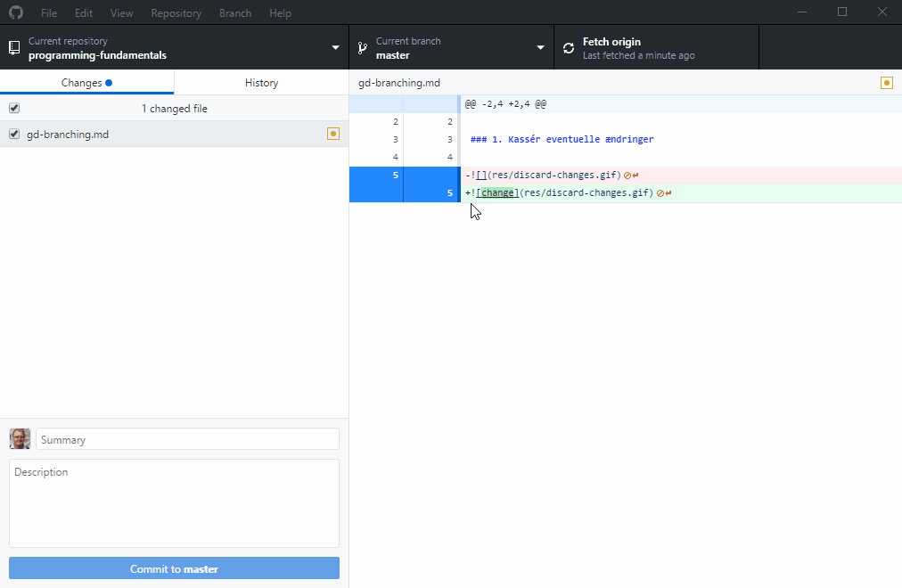
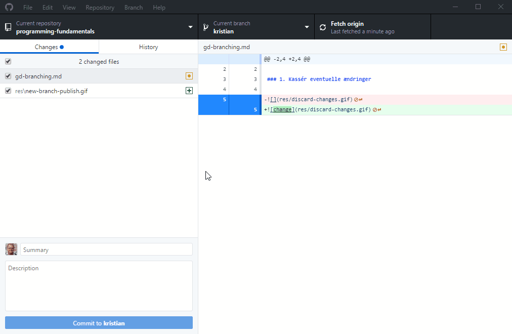
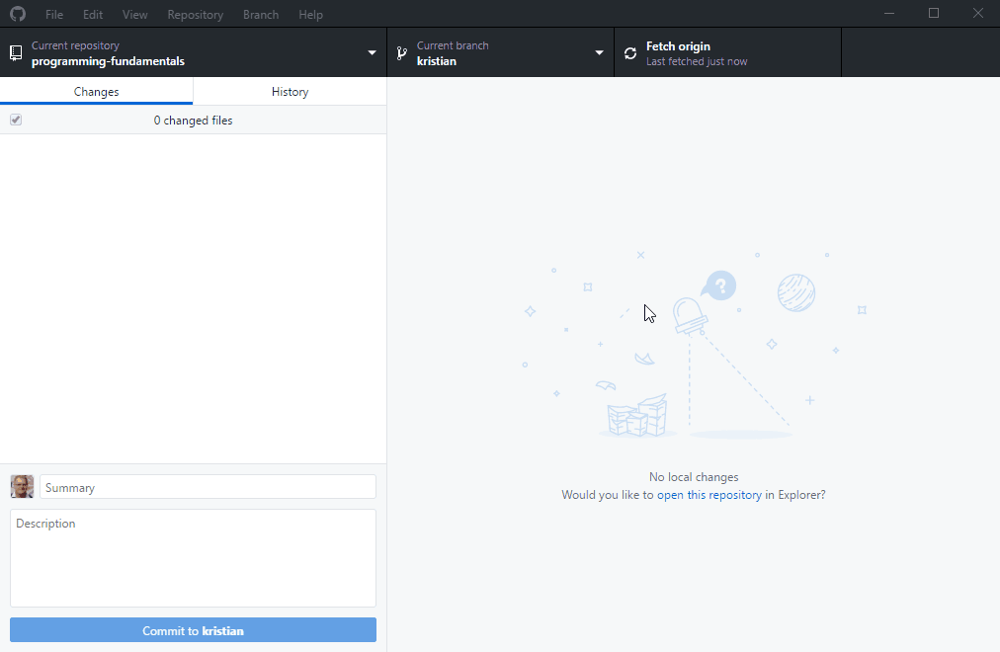

# Sådan gemmer du dit arbejde (Github Desktop)

Målet med denne tutorial er, at du skal kunne gemme dit eget arbejde, men samtidig hente mine opdateringer.

Til dette formål laver vi en **branch** (forgrening): alle kursister får deres egen tidslinie i projektet, hvor de ser mine og deres egne tilvirkninger - men ikke de andres.

## Forudsætninger

Du får ikke lov til at gennemføre denne tutorial, medmindre du er blevet tildelt rettigheder på Github. Send mig dit brugernavn, så bliver du tilføjet.

## 1. Lav en ny branch

Vi opretter den alternative tidslinie, som du kan arbejde på fra nu af. Dette skal kun gøres én gang.

- Tryk på knappen **Current branch**.
- Tryk på knappen **New**.
- Navngiv din branch. Brug gerne dit eget navn.
- Tryk på synkroniseringsknappen, der nu hedder **Publish branch**.

## 2. Lav et commit

Når du har ændringer, som du ønsker at beholde, _committer_ du dem i din egen tidslinie.

- Lav nogle ændringer, som efterfølgende kan ses i **Changes**.
- Sørg for, at din egen branch er **Current branch**.
- Sørg for, at alle ændringer har et flueben i Changes-listen.
- Skriv en titel for ændringerne i **Summary**.
- Tryk på den blå knap, der er markeret med **Commit to [branch]**.
- Tryk på synkroniseringsknappen, der nu hedder **Push origin**.

## 3. Hent opdateringer

Når der er centrale ændringer, skal du igennem et ekstra trin.

- Sørg for, at du står på din egen branch under **Current branch**.
- Tryk på synkroniseringsknappen (**Fetch/pull from origin**), der opdaterer _master_-branchen, men ikke din egen.
- Gå op i menu **Branch > Update from default branch**. Opdateringerne er nu hentet ind i din branch.
- Tryk på synkroniseringsknappen, så du push'er din egen branch op. Du har nu en opdateret version af din egen branch.