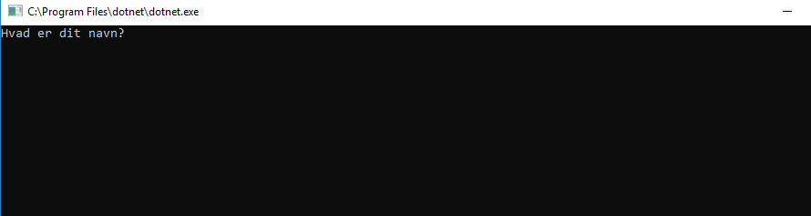

# Øvelse: user interaction


### Metoden `Console.ReadLine`

Metodesignatur: `static string Console.ReadLine()`

Vi har tidligere brugt `Console.WriteLine` og `Console.Write` til at lave _output_ i konsollen ved brug af `Console.ReadLine()`. Men det er også muligt at få et _input_ fra konsollen. Her venter programmet på brugerens indtastning, som kan være en tekst af vilkårlig længde. Når brugeren afslutter indtastningen med `<enter>`, bliver teksten til metodens returværdi.

```csharp
Console.Write("Hvad er dit navn? ");
string name = Console.ReadLine();
Console.WriteLine("Hejsa, " + name);
```

Resultat:



### Metoden `int.Parse`

Metodesignatur: `static int int.Parse(string input)`

Resultatet fra `Console.ReadLine()` vil altid være en `string`, hvilket ikke altid er hensigten. Hvis man f.eks. beder brugeren om et fødselsår, kan det være interessant at behandle indtastningen som et tal efterfølgende.

Vi kan bruge `int.Parse(string input)` til at konvertere en `string` til et heltal.

```csharp
string birthyearString = "1980";
int birthyearNumber = int.Parse(birthyearString);
int approximateAge = 2017 - birthyearNumber;
```

Hvis strengen indeholder tegn, der ikke kan konverteres, crasher programmet. Vi siger, at metoden kaster en _exception_. Det skal vi også lære at forhindre, men først i en senere lektion.

## Øvelserne

Solution: `src\Exercises\AskTheUser\AskTheUser.sln`

### Øvelse 1

Bed høfligt om brugerens navn, fødeår og hjemby. Informationerne skal gemmes i tre forskellige variabler.

Lav en samlet præsentation af brugeren: "Du hedder ..., er født i ..., og bor i ...".

### Øvelse 2

Lad os lave den beskedne antagelse, at alle brugere er født på årets første dag. 

Lav en ændring i teksten, så den skriver hvor gammel brugeren er.

### Øvelse 3

Vi er kun interesseret i at præsentere brugeren ved fornavn. Hvis brugeren har indtastet flere navne / fuldt navn, skal vi kun bruge det første navn i præsentationen.

### Øvelse 4

Det er skudår, hvis året kan deles med 4 - medmindre det kan deles med 100, så er det **ikke** skudår - dog, hvis det kan deles med 400, så er det **alligevel** skudår.

Tilføj til teksten, hvor mange skudår brugeren har oplevet.