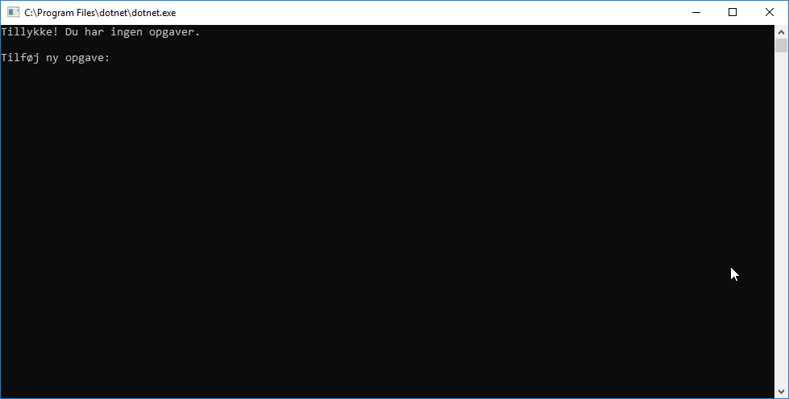
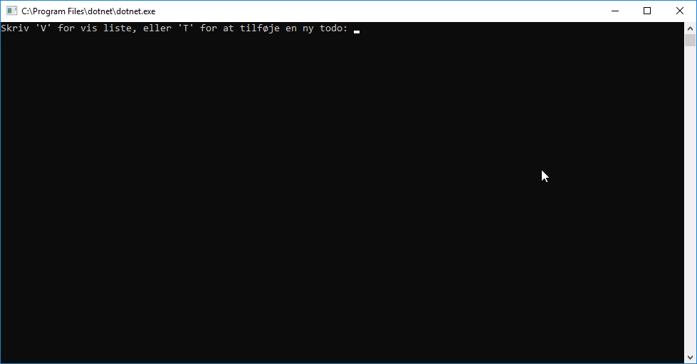
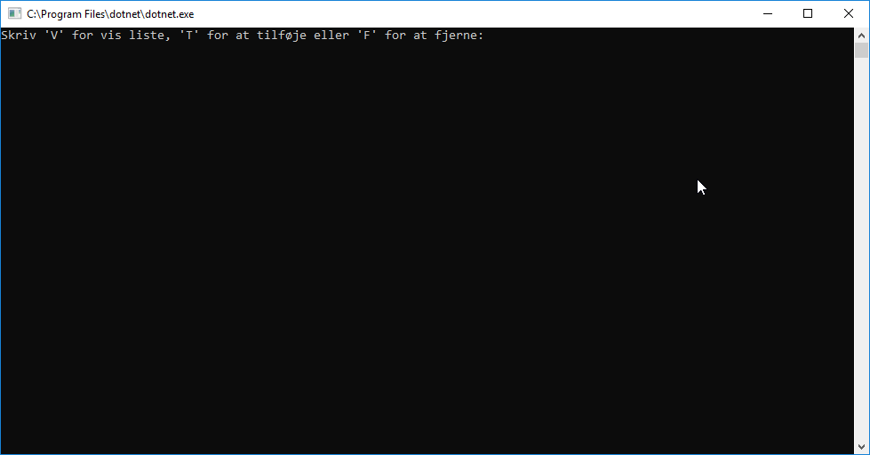

# Juleøvelse III: Todo

Solution: `src\Exercises\Todo\Todo.sln`

Nu bliver det alvor. Vi skal for første gang lave en meningsfuld applikation. Sværhedsgraden kan forekomme noget højere, men egentlig kombinerer vi bare alle teknikker op til nu til at lave et længere, sammenhængende eksempel.

I sidste øvelse så vi, [hvordan vi kan bede brugeren om et input](../AskTheUser/README.md). I denne øvelse går vi et skridt videre, og benytter både lists og `foreach` til at lave en lille todo-applikation. Her er det måske en god idé at [genopfriske din viden om lists og `foreach` fra lektion 3/4](../../Week%203/README.md#list-og-foreach-loops).

## Øvelse 1
Vi ønsker, at applikationen starter med at fortælle os, at vi ikke har nogle opgaver. Den skal samtidig bede os om at tilføje en ny opgave. Når vi har tilføjet en opgave, skriver den hvor mange opgaver der aktuelt er på listen, og viser os en pænt opstillet punktliste.

Et par tips:

- Programmet skal køre uendeligt. Vi ønsker at kunne fortsætte med at tilføje, så hele applikationens logik kører i ring. Når vi vil have en uendelig liste, kan vi gøre det med `while`, hvor betingelsen slet og ret er `true`.
- Alle todo-items bør ligge i en liste. Vi kan tilføje nye items med metoden `.Add(string item)`. Vi kan køre en stump kode over alle items med `foreach`.
- Vi kan bede om det aktuelle antal opgaver på listen med property `.Count`.

## Øvelse 2
Vi ønsker en udvidelse, så vi på første niveau vælger en kommando: enten at tilføje en ny opgave, eller at vise den eksisterende liste.

Et par tips:

- Ja, det er nødvendigt at trykke enter efter at have tastet bogstavet.
- Det er en god idé at kigge på listen over [`string` methods](../../Week%203/README.md#flere-eksempler-p%C3%A5-string-methods).

Bonuspoint:

- Det er et plus, hvis det er ligemeget, om man skriver med stort eller småt.
- Det er et plus, hvis det også virker at skrive "vis" eller "tilføj" i stedet for blot et enkelt bogstav. Måske kan man nøjes med at kigge på første bogstav?

## Øvelse 3
Vi ønsker at tilføje `"S"` for _stop_ som en ny kommando på øverste niveau. Hvis man vælger denne, kører løkken ikke længere, og programmet slutter.

## Øvelse 4
Denne opgave er betragteligt sværere end de øvrige.

Vi ønsker at tilføje `"F"` for _fjern opgave_ som en ny kommando på øverste niveau. Når vi vælger denne, vises alle opgaver med et tal, der tilsvarer deres position i listen. Vi får herefter mulighed for at angive hvilket indeks, der er løst. Denne opgave fjernes så.

Et par tips:

- Vi kan tilgå det enkelte element i en liste via indeks. Givet, at variablen indeholdende listen hedder `todo`, kan vi tilgå det tredje element med `todo[2]`. Husk, at det første element ligger på indeks `0`.
- Vi kan fjerne et element ud fra dets indeks med `.RemoveAt(int index)`.