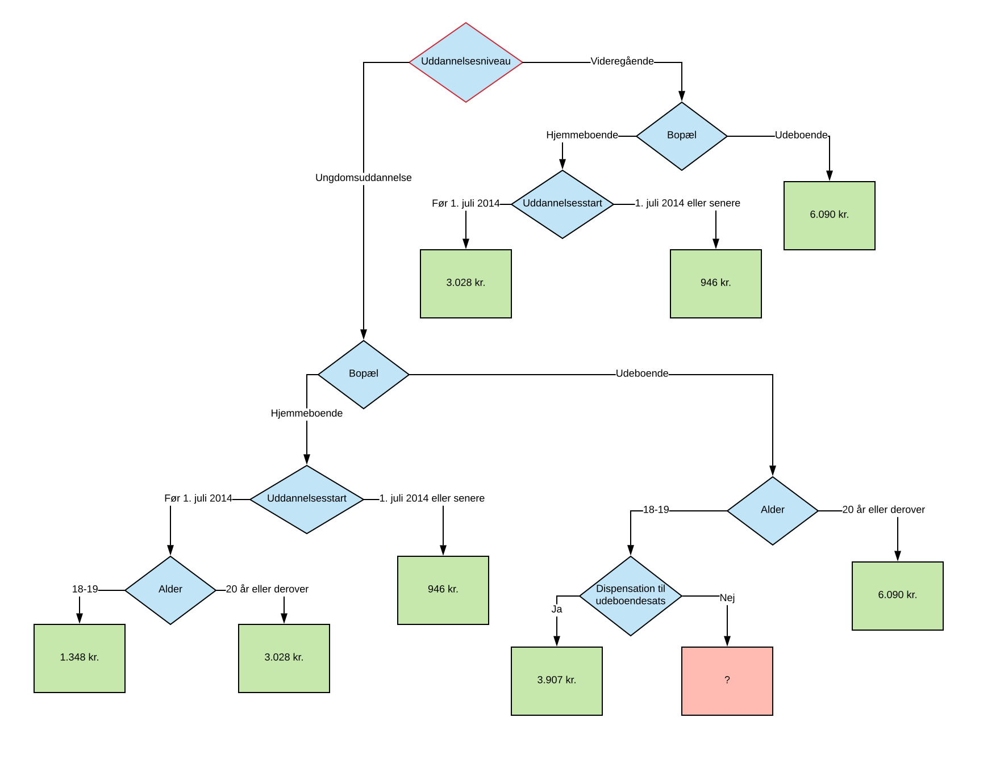

# Metoder, fortsat

I denne uge laver vi kun øvelser. Metoderne skal lige rodfæstes lidt bedre, før vi er klar til at fortsætte til næste emne.

## Øvelse 1

Når man skal finde ud af, hvor meget man som studerende er berettiget til at modtage i grundsats for SU, afhænger det af kombinationen af uddannelsesniveau, alder, bopæl, dato for uddannelsesstart og 

Se kilden 

Hvis vi laver en direkte oversættelse af navigationen til et beslutningstræ, ser vi følgende struktur:

http://www.su.dk/satser/